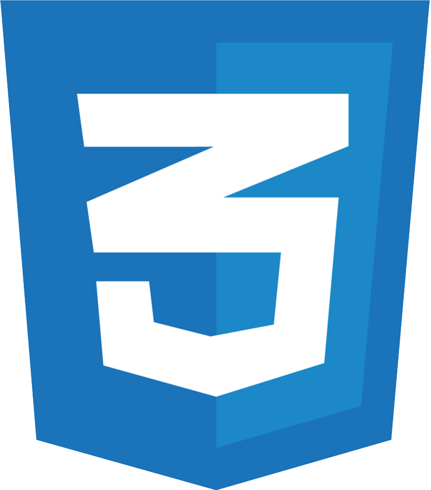
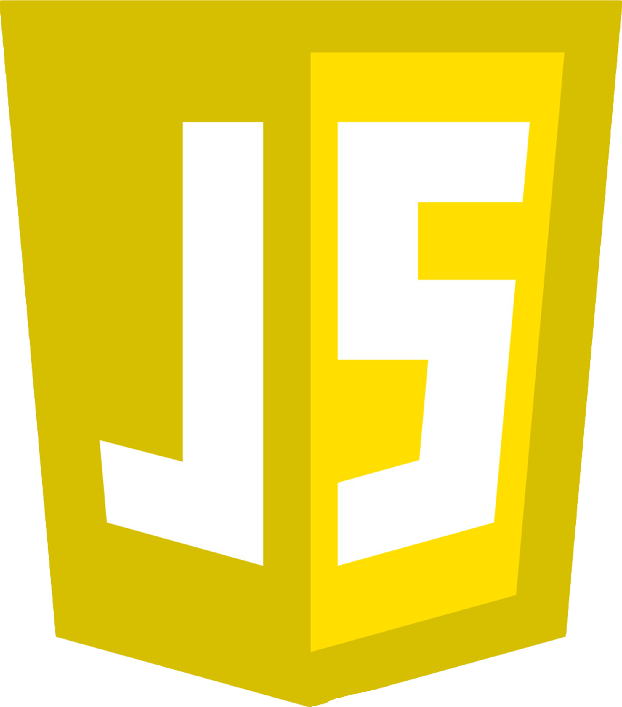
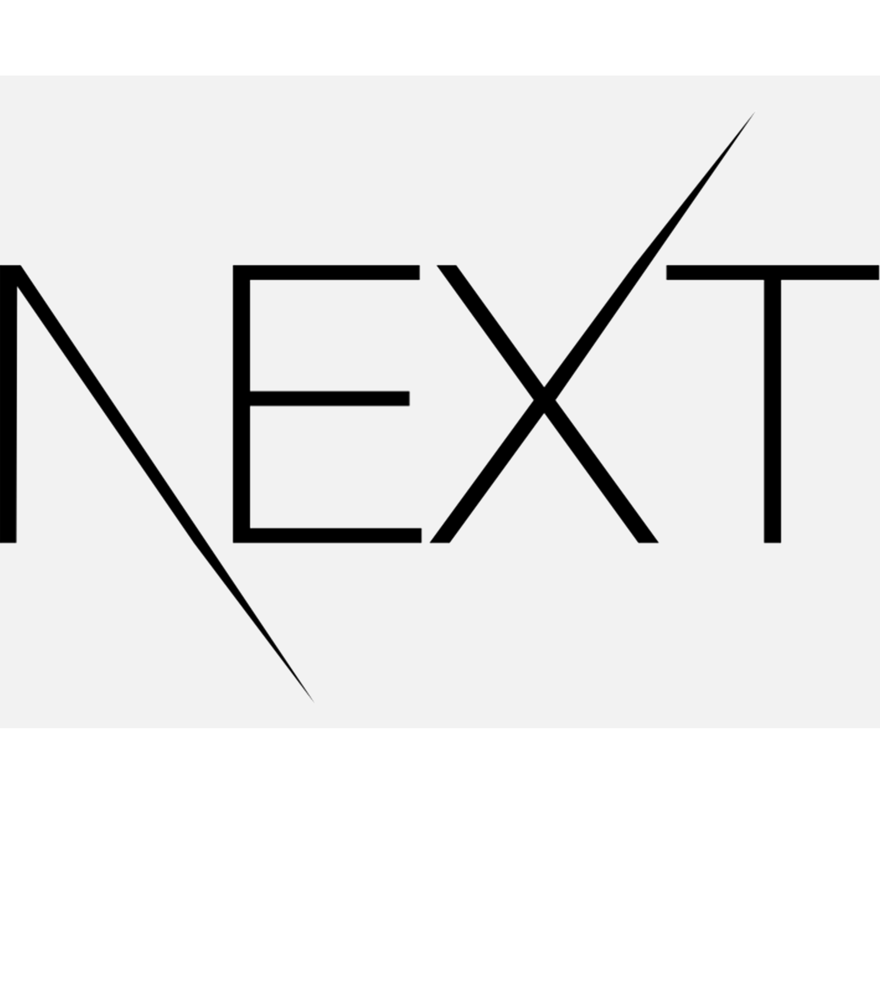

### Hello! Welcome to my profile. 👋

My name is Pedro Cantanhêde, I'm 20 years old. Currently living in Brazil. I'm studying Information Systems at CEFET-RJ and my goal is to master HTML, CSS and JavaScript soon! I am looking for improvement in my skills and myself as a developer.

"It's not how much time you have, it's how you use it." 💭

<h3>🚀 Languages and Tools:</h3>

<h3>✍🏻 I wanna learn:</h3>

---

<h3 align="center">💬 Follow me!</h3>

<!--
**PedroCantanhede/PedroCantanhede** is a ✨ _special_ ✨ repository because its `README.md` (this file) appears on your GitHub profile.

Here are some ideas to get you started:

- 🔭 I’m currently working on ...
- 🌱 I’m currently learning ...
- 👯 I’m looking to collaborate on ...
- 🤔 I’m looking for help with ...
- 💬 Ask me about ...
- 📫 How to reach me: ...
- 😄 Pronouns: ...
- ⚡ Fun fact: ...
-->
